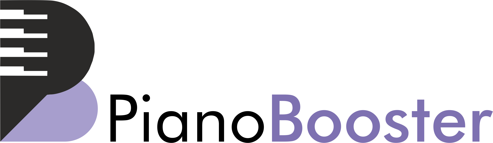

# == THE URL HAS CHANGED ==

This **PianoBooster** repository has now been transferred to @pianobooster as the new owner.

Please update all your bookmarks and [update](https://docs.github.com/en/free-pro-team@latest/github/using-git/changing-a-remotes-url) any existing local clones to point to the new repository URL https://github.com/pianobooster/PianoBooster

# INTRODUCTION

**PianoBooster** is a MIDI file player that displays the musical notes AND teaches you how to
play the piano.
The difference between playing along to a CD or a standard MIDI file
is that Piano Booster listens and reacts to what you are playing on a
MIDI piano keyboard.
You can play along to any track in the MIDI file and Piano Booster will
follow your playing. Piano Booster makes learning to sight read fun!

Piano Booster is a free (Open Source) program, available from: <https://www.pianobooster.org/>

# FEATURES

* The musical accompaniment follows your playing, if you stop then so does the music.
* Play a single hand and Piano Booster will play the other hand in time with you.
* Change the speed of playback to match your playing ability.
* Transpose +/- 12 semitones without stopping the play back.
* Plays any standard MIDI or KAR file.
* Play along to any instrument in the MIDI file.
* Adjust the volume of the current part or the volume of your piano part.
* Measures the accuracy of your playing.
* Timing markers show if you are playing ahead or behind the beat.
* A different instrument sound is used for the right and wrong notes that you play on the piano.

# GETTING STARTED

Binary executable version of **PianoBooster** are available for Windows, MacOS and Linux, which can be downloaded from the [Piano Booster website](<https://www.pianobooster.org/>).
Piano Booster now includes a built in version of the FluidSynth sound generator.
In order for FluidSynth to work and to hear sound a `.sf2` (sound font) file is required which must be loaded using the MIDI Setup/Fluidsynth menu of Piano Booster.
A recommended General Midi (GM) sound font file is the `FluidR3_GM.sf2`

To play along with **PianoBooster** you will need a MIDI Piano Keyboard.
If you don't have a MIDI keyboard you can still try out Piano Booster using the PC keyboard, 'x' is middle C - but a MIDI piano is highly recommended.
After connecting the MIDI keyboard you need to setup the midi input device using
the Piano Booster MIDI setup menu.

**PianoBooster** now comes with a music teaching course called Booster Music.
The MIDI files for this course are in a folder called `BoosterMusicBooks` located in the `Music` folder on your PC.
The Booster Music teaching course is also available on the [Piano Booster website](<https://www.pianobooster.org/>).
Use the File/Open from the Piano Booster menu to load the MIDI file ".mid" or a karaoke ".kar" file.

Finally choose the skill level, if you want to
just listen to the MIDI music  - select 'listen', to play along with a MIDI keyboard with
the music following your playing - select 'follow you' and then click on the Play icon to
start.

# TRANSLATIONS

**PianoBooster** isn't translated in your language? Help us, and we will gladly ship
new translations with it.

Please see the [Web-based continuous localisation](https://hosted.weblate.org/projects/pianobooster/) (Weblate) to contribute to the language translations.
The translation required for the Piano Booster app are located [here](https://hosted.weblate.org/projects/pianobooster/pianobooster/) and the translation for the Booster Music course are located [here](https://hosted.weblate.org/projects/pianobooster/boostermusic/).

# LICENSE

**PianoBooster** is fully copyrighted by the authors and all rights are reserved.

**PianoBooster** is free software (Open Source software): you can redistribute it and/or modify
it under the terms of the GNU General Public License as published by the Free Software
Foundation, either version 3 of the License, or (at your option) any later version.

**PianoBooster** is distributed in the hope that it will be useful, but WITHOUT ANY WARRANTY;
without even the implied warranty of MERCHANTABILITY or FITNESS FOR A PARTICULAR PURPOSE.
See the GNU General Public License in the file "gplv3.txt" or from the web site
<http://www.gnu.org/licenses/> or [gplv3.txt](gplv3.txt).

The **PianoBooster** documentation and music are released under the Creative Commons License (CC-BY).

[PianoBooster License](license.txt)

# SOURCE CODE

As part of GNU General Public License the source code for **PianoBooster** is available from
the GitHub site  <https://github.com/pianobooster/PianoBooster>. See the [BUILD.md](BUILD.md) for
instructions on how to build the source code.

This source code URL has recently changed so please update all your bookmarks and change any existing local clones to point to the new repository URL.

# BUGTRACKER

[Issues](https://github.com/pianobooster/PianoBooster/issues)

# CONTRIBUTING

**PianoBooster** is community developing project. You're welcome with patches:

[Pull Requests](https://github.com/pianobooster/PianoBooster/pulls)

We have many [issues](https://github.com/pianobooster/PianoBooster/issues) always.

We are looking for musicians to make music for pianobooster. It can be educational courses or other melodies: [music sources](https://github.com/pianobooster/BoosterMusic).

Thanks to everyone who has already made contributions to the Piano Booster project.
