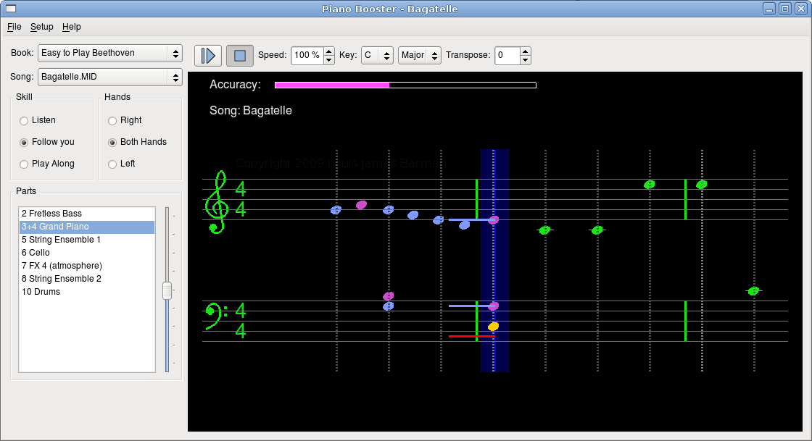
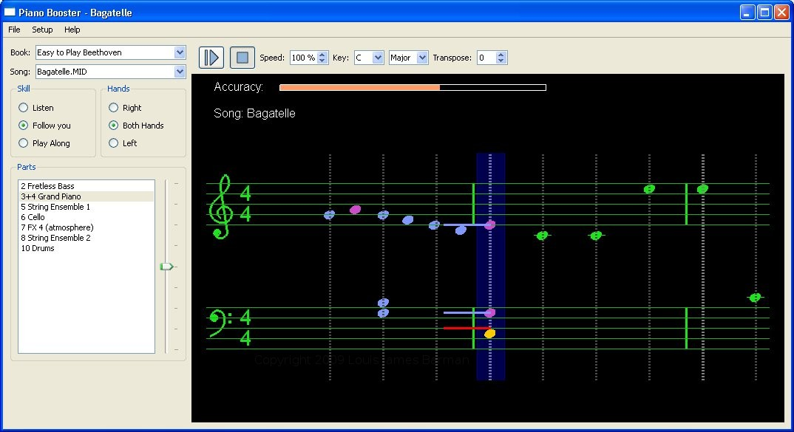
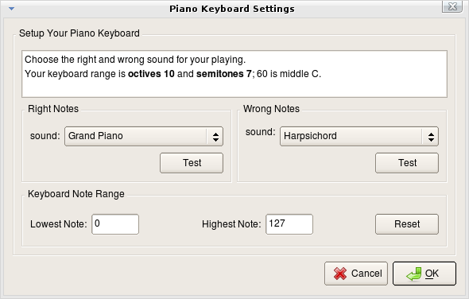

# Boost your Piano playing skills

- [Presentation](#presentation)
- [Introduction](#introduction)
- [PianoBooster in Action](#pianoBooster-in-action)
- [Timing markers](#timing-markers)
- [Features](#features)
- [Screenshots](#screenshots)
- [FAQ](faq.md)
- [Hints on playing the Piano](pianohints.md)
- [Piano Booster Music](courses/README.md)

External links:
- [Original project](http://pianobooster.sourceforge.net)
- [Original source tree](http://sourceforge.net/projects/pianobooster/)
- [Original User Forum](http://piano-booster.2625608.n2.nabble.com/Piano-Booster-Users-f1591936.html)
- [Original Development Forum](http://piano-booster.2625608.n2.nabble.com/Piano-Booster-Development-f2625691.html)

## Presentation

*PianoBooster* is a fun way of playing along with a musical accompaniment and at
the same time learning the basics of reading musical notation.  The difference
between playing along to a CD or a standard midi file is that *PianoBooster*
listens and follows what you are playing on a midi piano keyboard.

### Introduction

*PianoBooster* is a free (Open Source) program that plays Standard Midi Files
and allows you to change the speed of playback
and transpose the music etc.
There is a scrolling musical stave that shows the notes for just one part
from all the parts in the complete musical arrangement.

Piano Booster main screen

*PianoBooster* has been designed to allow you to play along on a midi piano
keyboard with the scrolling notes shown on the screen. The notes you press on
the keyboard appear as coloured lines on the musical stave, the colour of which
depends whether you have pressed the right or wrong note.

A different musical instrument sound is used for your playing depending whether
you are playing the right or wrong notes. This feature also allows
PianoBooster to be used with printed sheet music so you can hear if you are
playing the right notes while at the same time keeping your eyes on the printed
score. The music accompaniment will automatically wait for you to find and play
the correct notes in the piece.

### PianoBooster in Action

Watch the video and see the features of *PianoBooster* in action.

*Piano Booster* is piano teaching software that can provide piano lessons for
beginners as well as for advanced players.

It can be used for teaching music theory and is useful for piano practice and
learning piano technique.

### Timing markers

Timing markers show whether you are playing ahead or behind of the beat.
They appear as white crosses that are drawn over the note.
Timing markers are new in version 0.6.2.

## Features

- Piano Booster *follows your* playing when playing along to a musical  accompaniment. (If you stop then so does the music).
- Play a *single hand* and Piano Booster will play the other hand *in time* with you (and will also play the violins, the bass, the drums etc. *in time* with you).
- Change the *speed* of playback to match your playing ability.
- *Transpose* +/- 12 semitones *without stopping* the play back.
- Change the *Key Signature* of the piece.
- Plays any standard *midi* or *kar* file.
- Play along to *any instrument* in the midi file.
- Adjust the *volume* of the current part or the *volume* your piano part.
- See the *accuracy* of you playing.
- Change the *start bar* to start playing from any bar in the music. The *repeat bars* allows you to practice just a few difficult bars continuously.
- *Timing markers* are white crosses that are drawn over each note and show if you are playing ahead or behind the beat.
- A different instrument sound is used for the right and wrong notes that you play.

## ScreenShots

Piano Booster main screen - Linux

Piano Booster main screen - Windows

Piano Booster annotated screenshot

Piano Booster timing markers

Piano Booster keyboard setup

Piano Booster MIDI Setup Dialog
